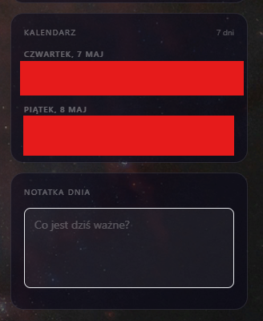
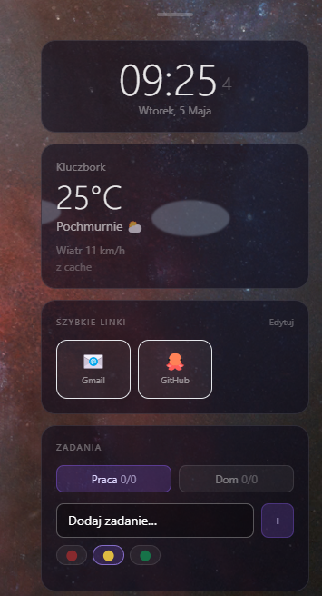

# DailyManager

A small desktop side panel to help you run your day: tasks, Google Calendar, quick links, notes, and weather.

Built with Electron + Vite + React + TypeScript.

## Run it locally

1. Install dependencies:

```bash
npm install
```

2. Copy the env file:

```bash
cp .env.example .env
```

3. Fill your Google OAuth values in `.env`:

- `GOOGLE_CLIENT_ID`
- `GOOGLE_CLIENT_SECRET`

Optional:
- `GOOGLE_REDIRECT_PORT` (default: `42813`)
- `GOOGLE_REDIRECT_URI` (default: `http://localhost:42813`)

4. Start the app:

```bash
npm run dev
```

## Build installer

```bash
npm run build
```

The installer will be generated in `release/`.

## Security notes

- Keep `.env` local (do not commit it).
- Google OAuth tokens are saved locally in `userData/google_tokens.json`.

## Current features

- live clock + date
- tasks (categories, priorities, subtasks)
- natural language deadlines (e.g. "tomorrow 14:00")
- Google Calendar integration (create/remove events from tasks)
- daily note
- quick links
- tray support + auto start

## Screenshots

<p>
  
</p>
<p>
  
</p>
